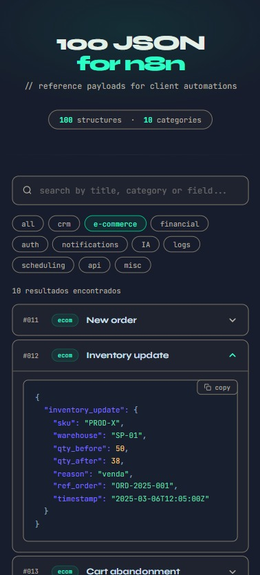

# 100 JSON Structures for n8n

A reference collection of 100 ready-to-use JSON payloads organized across 10 categories — CRM, e-commerce, finance, auth, notifications, AI, logs, scheduling, API, and misc. Built as a single self-contained HTML file with live search, category filters, accordion cards with syntax highlighting, and a one-click copy button. Handy when you need a realistic payload to wire up a workflow fast.
